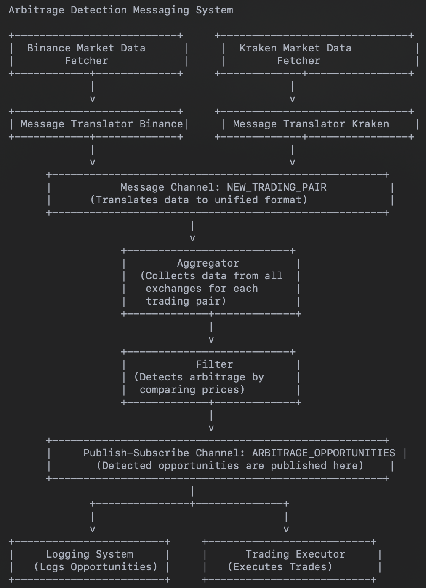

# Crypto Arbitrage

Welcome to the **Crypto Arbitrage** project! This repository contains the codebase for an automated arbitrage trading
system that monitors cryptocurrency prices across multiple exchanges, detects arbitrage opportunities, and executes
trades to capitalize on price discrepancies.

## Overview

This project is designed to be modular and scalable, leveraging enterprise integration patterns such as messaging
channels, content-based routing, and more. The system is composed of several key components that communicate through
Kafka message queues, ensuring flexibility and resilience.

## Messaging System Architecture

  
*Diagram of the messaging system architecture will be displayed here.*

1. We will have different point to point channels, for exchange fetching (Binance, Kraken, New Exchanges..). This
   channels are private to only the related applications (so far, the message translator for each echange)
2. For each exchange, we will have a Message Translator to format the incoming data format into our desired "
   NEW_TRADING_PAIR" format
3. We will have public Data Type Channel, is meant to be used by different applications but only accepts specific
   Canonical Data Model, called NEW_TRADING_PAIR .
4. The Aggregator combines the results from the different exchanges and passes the resulting message to a filter
   channel.Waits until it has received the latest data from all relevant exchanges for each trading pair.
5. Filter: Compares prices between exchanges to detect arbitrage opportunities.
6. Publish-Subscribe Channel (ARBITRAGE_OPPORTUNITIES): A channel that broadcasts detected arbitrage opportunities for
   further processing by different consumers.
7. Consumers (Logging System, Trading Executor):
   • Logging System logs detected opportunities.
   • Trading Executor executes trades based on the detected opportunities.

## Tools and Libraries

- **Message Broker:** Kafka
- **Python Libraries:**
    - `confluent_kafka` for Kafka integration
    - `ccxt` for exchange integration
    - `pandas` for data handling
    - `logging` for logging

## Final Deliverable

The final deliverable is a modular trading bot with components communicating via Kafka message queues, ensuring
flexibility, scalability, and resilience. Which is able to detect arbitrage opportunities across different exchanges

## Discussion points

1. Should we Implement topics within NEW_TRADING_PAIR channel